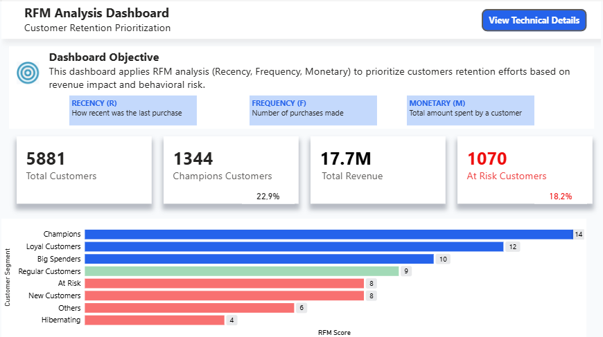
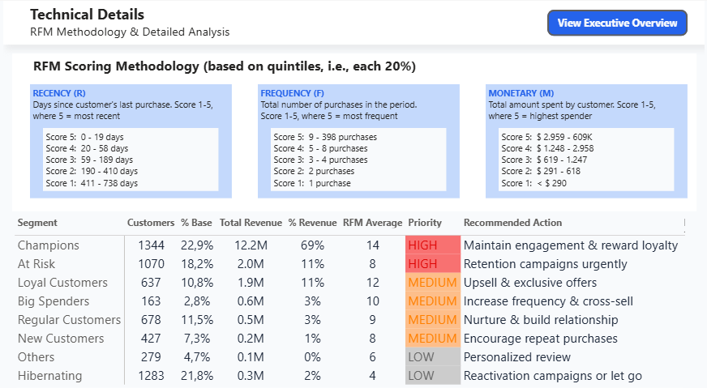

## Data Analytics Portfolio – Olivia Grauso

**Contact**: LinkedIn [Olivia Grauso](https://www.linkedin.com/in/oliviagrauso/) Email: *olivia.grauso@outlook.it*

---
I approach data analysis with logic and structure, focusing on answering real business questions.  
My work is based on clear analysis and organized methodology, delivering practical results.

This repository contains selected projects developed using SQL and Power BI.

---

### Customer Retention Prioritization (RFM Analysis)

**Business Context and Objective**

Assuming the retention team can act only on part of the customer base, which customers represent the highest risk and the highest value?  
Since resources are limited, prioritization becomes essential.  

---

**2-Minute Project Presentation:**  
[English](https://youtu.be/cY0CvPjxSI0) | [Italiano](https://youtu.be/k0VEmz4HmFs)

---

[View in Power BI](https://app.powerbi.com/view?r=eyJrIjoiNjEwNmM3NjUtZDE5Mi00ZDJiLThhNTAtOTExM2M1MzdhMDE2IiwidCI6ImEzZjA0ZTNkLTE2NWMtNDZiZC1hMzY4LWY0ZTI1NDhlMWIyZCJ9)  

  

---
  

---

**Dataset and tools**
- Online Retail II dataset (Kaggle) - standard retail transactional data
- PostgreSQL (pgAdmin 4) for data transformation and modeling   [View SQL Script](customer-retention-rfm/project_retail_1.sql)
- QuickDBD for ERD diagram design  [View ERD diagram](customer-retention-rfm/customer_rfm-ERD.png)
- Power BI and DAX for visualization  [View in Power BI](https://app.powerbi.com/view?r=eyJrIjoiNjEwNmM3NjUtZDE5Mi00ZDJiLThhNTAtOTExM2M1MzdhMDE2IiwidCI6ImEzZjA0ZTNkLTE2NWMtNDZiZC1hMzY4LWY0ZTI1NDhlMWIyZCJ9)

**Methodology (SQL)**
- Data cleaning and transformation - reviewed each column and identified inconsistencies
- Customer-level aggregation
- RFM scoring using NTILE(5) quintile-based segmentation
- Segment classification
- Revenue concentration analysis

**Key Insights**
- 22% of customers (Champions) generate ~70% of total revenue (Pareto principle confirmed)
- 17% of customers are At Risk, representing 11% of revenue
- The analysis supports data-driven retention actions
  
**Final Consideration**

Even standard transactional data can generate strong strategic insights when analyzed with a structured and logical approach.  

[View in Power BI](https://app.powerbi.com/view?r=eyJrIjoiNjEwNmM3NjUtZDE5Mi00ZDJiLThhNTAtOTExM2M1MzdhMDE2IiwidCI6ImEzZjA0ZTNkLTE2NWMtNDZiZC1hMzY4LWY0ZTI1NDhlMWIyZCJ9)

---

